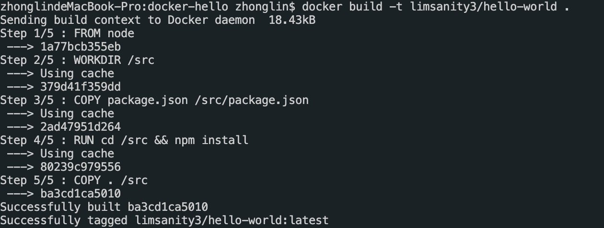
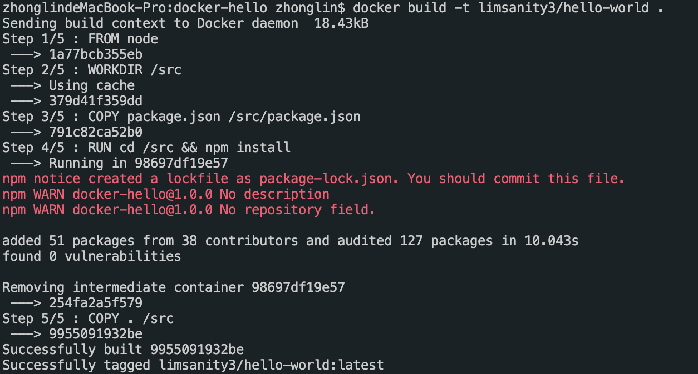

# 充分利用缓存

Docker的构建是分层的，一条指令一层。如果第n层发生了改动，第n层以后的缓存都会失效。大多数情况，判断缓存是否可用的方法是判断指令是否一致，对于COPY和ADD命令则会计算镜像内的文件和构建目录的校验。

## 实践

```js
mkdir hello-world && cd hello-world
npm init -y
npm i express

// S index.js
const app = require('express')();
app.listen(8080)
// E index.js

// S Dockerfile
FROM node

WORKDIR /src

COPY package.json /src/package.json

RUN cd /src && npm install

COPY . /src
// E Dockerfile

docker build -t limsanity3/hello-world .
```

完成第一构建之后，修改`index.js`

```js
// S index.js
const app = require('express')()
console.log('hello world')
app.listen(8080)
// E index.js

docker build -t limsanity3/hello-world .
```

此时在terminal中的输出，可以看到构建过程利用了缓存：



因此，如果我们把`package.json`和业务代码区分开来，只要没有引入新的npm包，前面的Step都可以利用cache。通常业务代码变动会比`package.json`大，因此编写Dockerfile时，要尽可能把变动较小的指令放到前面。

接下来验证第n层变动缓存发生变动，其后cache都不再生效的情况：

```js
npm i js-cookie

docker build -t limsanity3/hello-world .
```



使用npm安装新的包导致`package.json`内容发生变化，从Step 3开始，后面都不再使用cache，即便没有更新index.js。


### 参考

[利用构建缓存机制缩短Docker镜像构建时间](https://blog.csdn.net/weixin_34404393/article/details/88598139)

