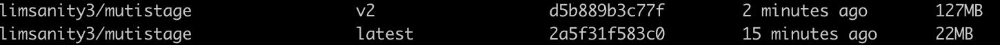

# 多阶段构建

多阶段构建是Docker 17.05的新特性，使得单个Dockerfile中可以执行多个阶段的构建，构建过程更容易维护。

## 实践

构建一个前端镜像通常需要两个步骤：在node环境下安装依赖包并完成build过程、将build出来的dist文件复制到nginx环境下container中制作成镜像。

```bash
vue create docker-mutistage
cd docker-mutistage

# S .dockerignore copy from .gitignore
.DS_Store
node_modules
/dist

# local env files
.env.local
.env.*.local

# Log files
npm-debug.log*
yarn-debug.log*
yarn-error.log*

# Editor directories and files
.idea
.vscode
*.suo
*.ntvs*
*.njsproj
*.sln
*.sw?
# E .dockerignore

# S Dockerfile
FROM node as builder

WORKDIR /app

COPY package.json /app/package.json
COPY package-lock.json /app/package-lock.json

RUN npm ci

COPY . /app

RUN npm run build

FROM nginx:alpine

COPY nginx.conf /etc/nginx/conf.d/default.conf
COPY --from=builder /app/dist /usr/share/nginx/html/

EXPOSE 80
# E Dockerfile

# S nginx.conf
# 开启gzip
gzip on;

# 启用gzip压缩的最小文件，小于设置值的文件将不会压缩
gzip_min_length 1k;

# gzip 压缩级别，1-10，数字越大压缩的越好，也越占用CPU时间，后面会有详细说明
gzip_comp_level 2;

# 进行压缩的文件类型。javascript有多种形式。其中的值可以在 mime.types 文件中找到。不对图片做gzip
gzip_types text/plain application/javascript application/x-javascript text/css application/xml text/javascript;

# 是否在http header中添加Vary: Accept-Encoding，建议开启
gzip_vary on;

# 禁用IE 6 gzip
gzip_disable "MSIE [1-6]\.";

server {
  # 监听80端口
  listen       80;
  server_name  localhost;

  # 开启零拷贝
  sendfile     on;

  location / {
    root /usr/share/nginx/html;
    try_files $uri $uri/ /index.html;
  }
}
# E nginx.conf

docker build -t limsanity3/mutistage .
```

可以看到在Dockerfile文件中有两个From，指定两个阶段的工作。build阶段中因为要使用npm ci，所以要复制package-lock.json，否则会报错。npm ci安装包是锁版本的，如果使用npm install则会有一个请求包版本的过程，降低安装速度。nginx使用了alpine镜像，alpine镜像用的是Alpine Linux内核，比ubuntu内核小的多：

