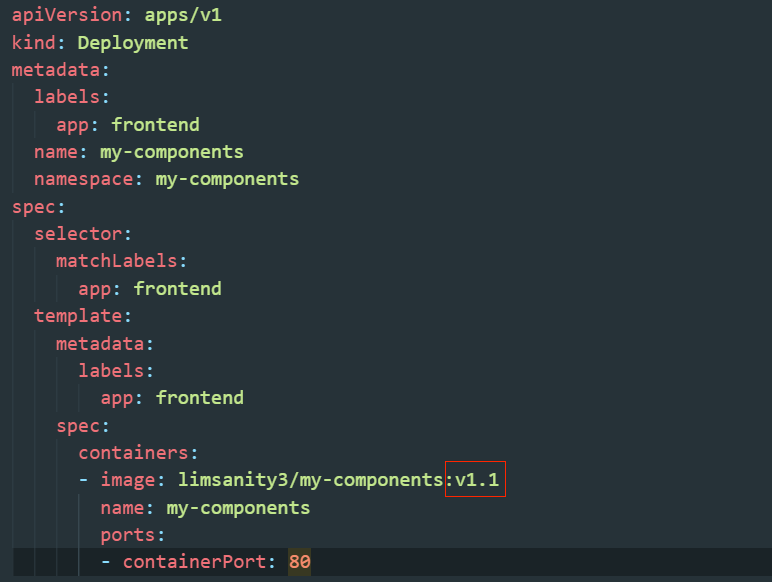
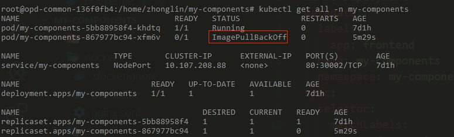
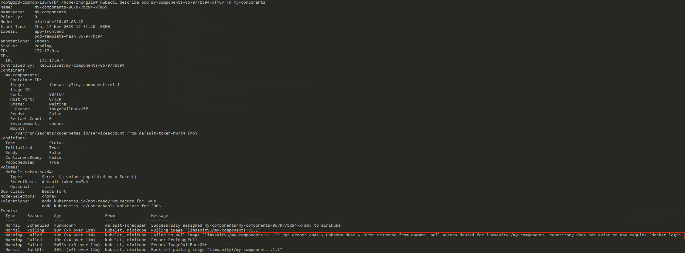
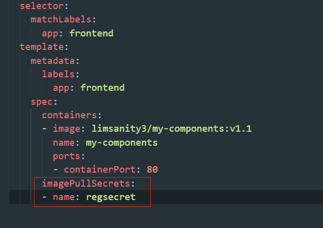

## Kubernetes命令

### 更新deployment中的镜像：

本地更新docker镜像，build时指定tag

deployment.yaml中更新image字段的值：



`kubectl apply -f deployment.yaml` 更新

如果pull的是private镜像，则可能出错，查看原因：

`kubectl get all -n my-components`



进入对应的pod中查看原因可以未登录docker hub：

`kubectl describe pod my-components-867977bc94-xfm6v -n my-components`



创建secret：

注意要指定namespace，否则即使下面yaml制定了imagePullSecrets也无效。kubectl edit secret变更namespace不会生效。

```bash
kubectl create secret docker-registry regsecret --namespace=my-components --docker-server=https://index.docker.io/v1/ --docker-username=limsanity3 --docker-password=xxxxx --docker-email=798607646@qq.com
```

查看secret：

```bash
kubectl get secret regsecret --output=yaml
```

查看`.dockerconfigjson`内容：

```bash
kubectl get secret regsecret --output="jsonpath={.data.\.dockerconfigjson}" | base64 --decode
```

查看`auth`内容：

```bash
echo "c3R...zE2" | base64 --decode
```

输出是username:password。注意auth字段的值和`~/.docker/config.json`中的值一致。




回滚更新：

```bash
kubectl rollout undo deploy my-components -n my-components
```

重新更新：

```bash
kubectl apply -f deployment.yaml
```

查看rollout状态

```bash
kubectl rollout status deploy my-components -n my-components
```

查看rollout历史

```bash
kubectl rollout history deploy my-components -n my-components
```

#### 参考

- [Pull an Image from a Private Registry](<https://kubernetes.io/docs/tasks/configure-pod-container/pull-image-private-registry/>)
  - 涉及secret创建

- [在Kubernetes中pull私有镜像](<https://note.qidong.name/2019/01/pull-private-images-in-k8s/>)
  - 涉及secret中namespace的说明