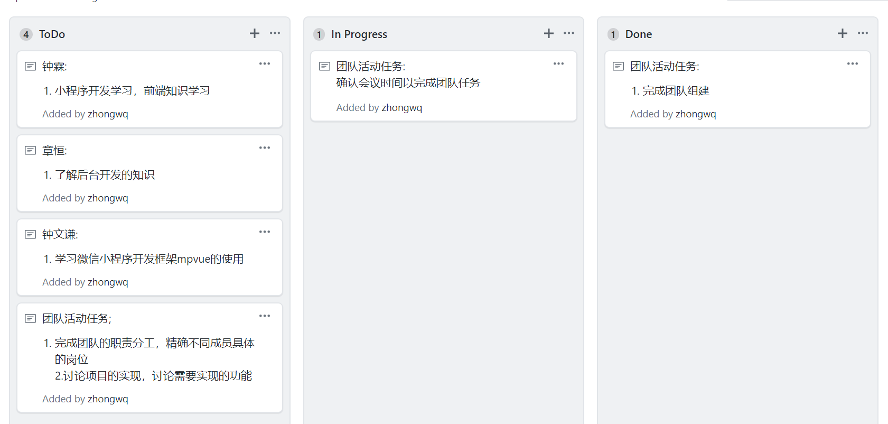
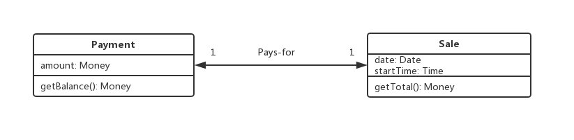

## 用简短的语言给出对分析、设计的理解

- 分析是对问题进行剖析和理解，对需求进行研究和调查
- 设计是提出对需求研究和调查结果的解决方案

## 用一句话描述面向对象的分析与设计的优势

- 面向对象的分析与设计能够明确清楚用户的需求，而单独的对问题进行探究，能够更快速得到结果

## 简述 UML（统一建模语言）的作用。考试考哪些图？

- UML可以将一个程序转换成图形的方式来呈现，通过不同图形来代表不一样的意义，开发人员很容易就可以从图中得知相关信息。
- 考试图：
  - 用例视图：用例图
  - 设计视图：类图、对象图
  - 进程视图：序列图、协作图、状态图、活动图
  - 实现视图：构件图
  - 拓扑视图：部署图

## 从软件本质的角度，解释软件范围（需求）控制的可行性

- 软件具有可变性、复杂性、不可见性，这意味着开发软件这个过程必定是极具难度的，因此需求控制就非常有必要了，并且需求控制也是可行的，这得益于软件的一致性。一致性指的是软件工程中固定的部分，例如语法规范、工作流等规则，对这些范围进行控制，可以极大节约成本。

## 看板练习

## UML绘图工具练习

