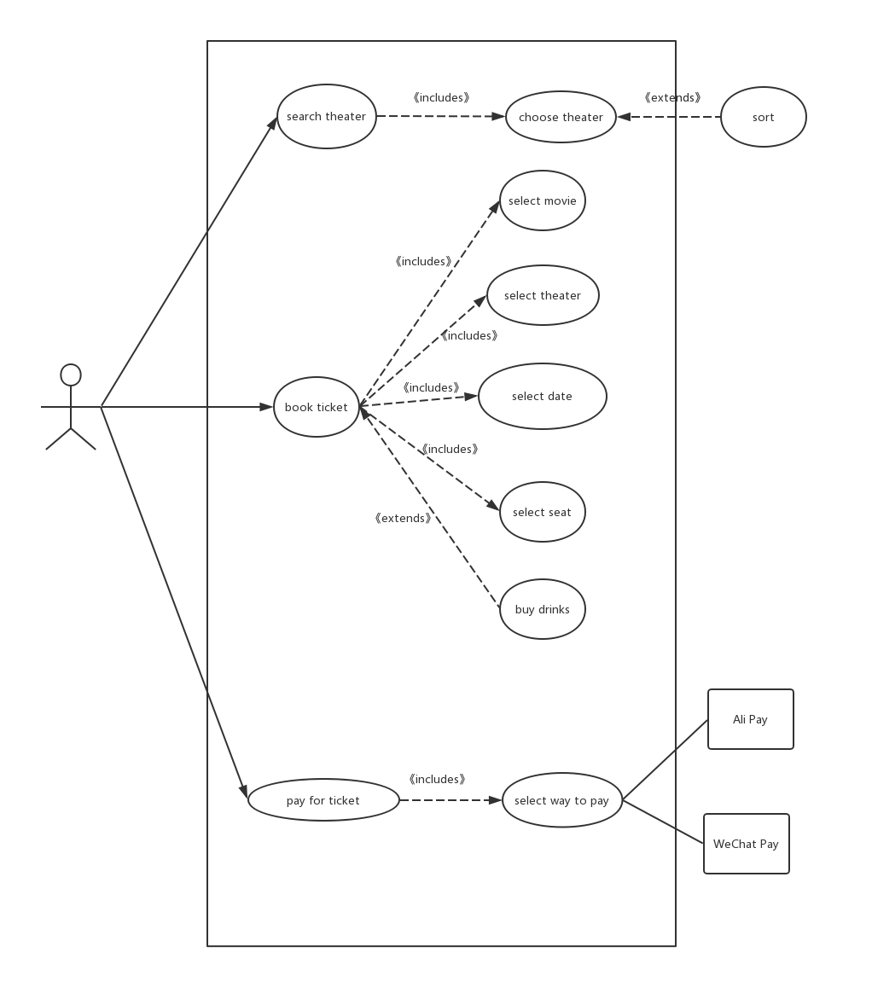

## 用例的概念

- 在不展现一个系统或子系统内部结构的情况下，对系统或子系统的某个连贯的功能单元的定义和描述。

## 用例和场景的关系？什么是主场景或 happy path？

### 用例和场景的关系

- 用例可以是一组场景，描述不同场景下的行为。这种书写格式可以在任何时候描述有变体的行为，例如黑盒需求，业务流程，系统设计说明。

### 什么是主场景

- 主场景是用例中遵循的主逻辑路径，也被称为 happy path。

## 用例有哪些形式？

- Brief
- Casual
- Fully

## 对于复杂业务，为什么编制完整用例非常难？

- 复杂的业务具有诸多场景，并且场景也会复杂，无法完整考虑到所有的场景

## 什么是用例图？

- 用例图是指由参与者（Actor）、用例（Use Case），边界以及它们之间的关系构成的用于描述系统功能的视图。用例图（User Case）是外部用户（被称为参与者）所能观察到的系统功能的模型图。用例图是系统的蓝图。用例图呈现了一些参与者，一些用例，以及它们之间的关系，主要用于对系统、子系统或类的功能行为进行建模。

## 用例图的基本符号与元素？

- 参与者：系统以外的，在使用系统或与系统交互中所扮演的角色
- 用例：对包括变量在内的一组动作序列的描述，系统执行这些动作
- 系统边界：表示系统的组成部分，边界外表示系统外部
- 箭头：表示参与者和系统通过相互发送信号或消息进行交互的关联关系

## 用例图的画法与步骤

- 确定执行者
- 确定系统的边界和范围
- 确定用例
- 将用例归档
- 将用例细化

## 用例图给利益相关人与开发者的价值有哪些？

- 获取需求
- 指导测试
- 在其它工作流中起指导作用

## 用例图

### 为什么相似系统的用例图是相似的？

- 因为功能相似，并且用户对象也差不多，那么执行者和场景也是类似的

### 如果是定旅馆业务，请对比 Asg_RH 用例图，简述如何利用不同时代、不同地区产品的用例图，展现、突出创新业务和技术

- 对比不同时代、地区的用例图，考虑当地或当下人群的消费方向以及兴趣，删除旧时代一些冷门功能，并增加新时代的新业务

### 如何利用用例图定位创新思路（业务创新、或技术创新、或商业模式创新）在系统中的作用

- 用例图包含了各种场景，也就是用户使用时会经过的一些路径，可以在一些比较热门的功能上增加一些周边的销售，例如订购了电影票之后，弹出关于对应电影主题的周边产品，比如：复仇者联盟图案的杯子、手办等。

### 请使用 SCRUM 方法，选择一个用例图，编制某定旅馆开发的需求（backlog）开发计划表

| ID   | Title        | Est  | Iter | Imp  |
| ---- | ------------ | ---- | ---- | ---- |
| 1    | select hotel | 2    | 1    | 5    |
| 2    | book room    | 2    | 3    | 5    |
| 3    | pay for room | 2    | 2    | 5    |

### 参考 [使用用例点估算软件成本](https://www.ibm.com/developerworks/cn/rational/edge/09/mar09/collaris_dekker/index.html)，给出项目用例点的估算

| 用例         | 事务 | 计算 | 原因 | 权重 |
| ------------ | ---- | ---- | ---- | ---- |
| select hotel | 4    | 3    |      | 简单 |
| book room    | 7    | 5    |      | 简单 |
| pay for room | 2    | 2    |      | 一般 |

