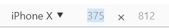
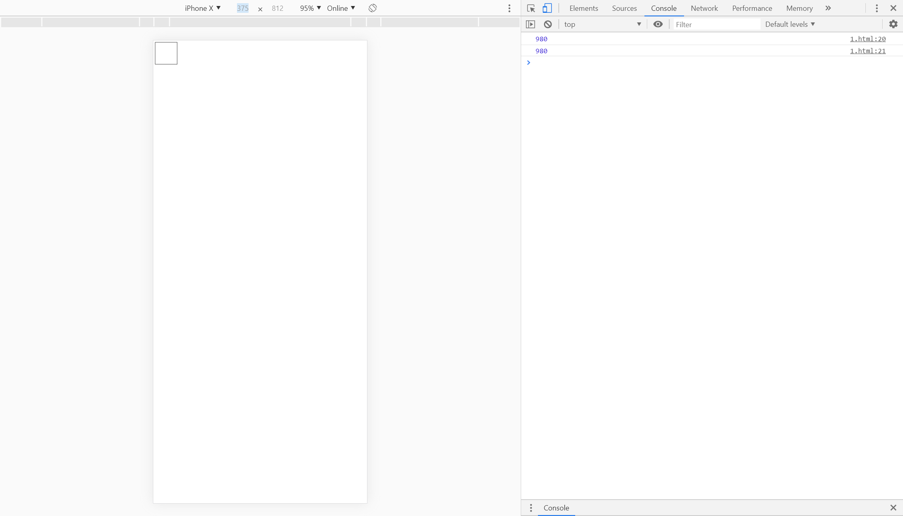
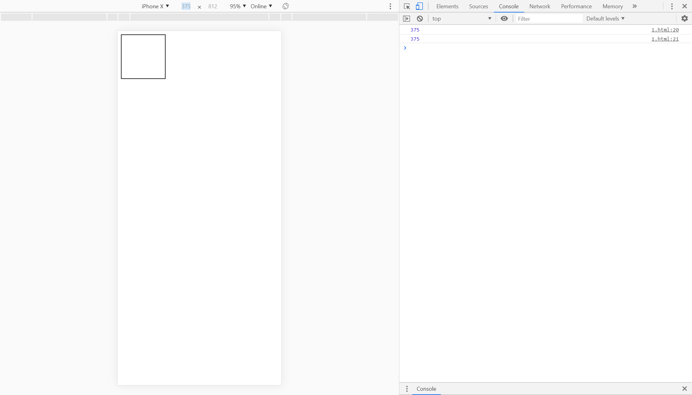

## meta标签

meta标签用于描述数据，它不会显示在页面上，但却可以被机器识别。

### 属性

- name：用于描述网页

  - keywords：描述网页的关键字。`<meta name="keywords" content="frontend">`
  - description：告诉搜索引擎该网页的主要内容。`<meta name="description" content="introduce meta tag">`
  - viewport：常用于移动端网页。`<meta name="viewport" content="width=device-width, initial-scale=1, maximum-scale=1, minimum-scale=1, user-scalable=no, minimal-ui">`
    - width指定视区的宽度，initial-scale设置页面的初始缩放比例，maximum-scale和minimum-scale指定用户对该网页的最大最小缩放操作，user-scalable设置用户缩放页面的权限，minimal-ui是safari新增的，可以隐藏顶部地址栏和底部导航栏
    - 当同时指定了initial-scale和width时，浏览器会以最大的进行设置，有些收集和浏览器横竖屏部分，则同时设置可以解决这个问题，但是ie不识别initial-scale，因此width可以解决它的问题。
    - 如果没有设置initial-scal=1，它的默认值也不会是1，浏览器会自动将页面缩小直到不会出现横向滚动条。

  - robots：定义搜索引擎爬虫的索引方式
    - none：搜索引擎忽略此网页
    - noindex：搜索引擎不索引此网页
    - nofollow：搜索引擎不继续通过此网页的链接索引搜索其他的网页
    - all：等价于index，follow
    - index
    - follow
  - author：标注网页作者
  - generator：标注网页制作软件
  - copyright：版权
  - revisit-after：搜索引擎爬虫重访时间。`<meta name="revisit-after" content="7 days">`
  - renderer：双核浏览器渲染方式。`<meta name="renderer" content="webkit|ie-comp|ie-stand">`。双核浏览器会有选择顺序进行渲染
  - http-equiv：相当于http头。`<meta http-equiv="content-Type" content="text/html; charset=utf-8">`
    - X-UA-Compatible指定浏览器采取何种版本渲染当前页面
    - cache-control
    - expires
    - refresh
    - Set-Cookie

## 移动端自适应原理

### rem

rem的值和根元素html的font-size有关，如果根元素font-size=100px，那么1rem=100px。

### 使用rem的好处

当遇上不同分辨率的手机，只需要js动态识别其分辨率大小，然后只需要更改根元素font-size，那么其他使用rem进行布局的元素就会自动进行相应的大小变化。

举个例子：当拿到一个750px分辨率的设计稿时，我们令根元素font-size=100px，那么一个宽度占375px的div可以写成width: 3.75rem(750px = 7.5rem = 7.5 × 100px)。当一台ideal viewport为375的手机访问这个页面，我们可以先用js获取其ideal layout大小（设置了meta标签后可以通过document.documentElement.clientWidth获取），然后求出它和设计稿分辨率的比值(ratio = 0.5 = 375 / 750 )，然后令其根元素font-size = 0.5 * 100 = 50px，那么在这部手机上看到的div宽度仍然只占屏幕的一半，因为这时候div宽度等于3.75 * 50 = 187.5px，刚好是375的一半。

### 聊聊viewport

移动端有3个viewport：layout viewport、visual viewport、ideal viewport

layout viewport

- 手机的layout viewport一般为1080或者980，这是因为要跟pc端网页相适应。下图是转载于网上的，从这张图我们就可以直观的看到什么是layout viewport，当layout viewport和pc端相适应时，那么元素的布局就不会变。

visual viewport

- 这个是浏览器的可视区域，可以通过window.innerWidth获取。仍然看下图，可视区域可以理解我们可以看到的区域。通常情况下，浏览器会将visual viewport缩放至和layout viewport一样大，这样手机屏幕就能显示整个pc端网页了，但是页面元素相当于被缩小了，看起来字体等等就会很小，用户就只能手动缩放来浏览网页。

ideal viewport

- ideal viewport的意义在于，针对ideal viewport开发的网站，不需要再缩放来访问了。这对于现在的网页开发来说是非常有必要的，因为移动端的用户实在太多了。ideal viewport的值由厂商自行设定，可以看看chrome模拟调试中iphoneX的ideal viewport。

移动端开发的时候会用到这么一段meta标签`<meta name="viewport" content="width=device-width, initial-scale=1, maximum-scale=1, minimum-scale=1, user-scalable=no, minimal-ui">`，其实就是将layout viewport的大小变为和ideal viewport一致。

当我们不设置meta标签时，打印出layout viewport(document.documentElement.clientWidth)和visual layout（window.innerWidth），上面说了，浏览器会将visual viewport 缩放至和 layout viewport一致。

设置了meta标签之后，可以看到，layout viewport大小就和ideal layout一致了。上面谈使用rem的好处的时候，也说到了设置meta标签之后通过document.documentElement.clientWidth可以拿到ideal layout大小，其实本质上还是layout viewport大小，只是此时layout viewport和ideal viewport一致。同样可以看到相同px的div，看上去就变大了。

### 适配的另一种做法（flexible.js）

前面分析rem的好处时，已经给出了一种适配的方法了，总结一下就是：

- 设置meta标签令layout viewport = ideal viewport
- 规定font-size大小，这里规定了100px是因为好计算，其他值也可以
- 求出ideal viewport大小和设计稿的比值。上面假设设计稿大小为750px，当然也可以是别的大小。
- 根据比值调整客户端根元素font-size即可

这里补充一点，我对设计稿的理解可以为一张图片，可以用chrome打开这种图片，查看这张图片所占的px。

另一种适配的方法是meta标签是类似于`<meta name="viewport" content="width=device-width initial-scale=0.5, maxmum-scale=0.5, minmum-scale=0.5, user-scalable=no"`，这里并不一定是0.5，而是经过计算得到的。

同样假设设计稿为750px，首先获取设备dpr，假设dpr为2，那么缩放因子scale为 1 ÷ 2 = 1 / 2，缩放因子即上面的0.5，设置了这个缩放因子后，layout viewport的大小就从375变成750了，令font-size=75px，那么1rem就等于75px，设计稿上一个375px大小的div，就设置为3.75rem。这样就实现了适配，其思想就是将layout viewport设置成和设计稿一样大，那么就可以按照设计稿进行布局了。

### 1px边框问题

设计稿中的1px指的是1物理像素，不是css像素，如果dpr为1，那么1物理像素对应1css像素，如果dpr为2，1css像素对应4物理像素，此时就会比设计稿中的大，如果使用rem和viewport的方法设置，就不会出现这个问题。

## 语义化

### 重要性

- 有利于搜索引擎进行搜索：例如h1标签和h3标签，搜索引擎会注重你所注重的关键字和内容。
- 有利于无障碍访问：对于视力受损的人，屏幕阅读器会重点朗读出类似于标题之类的重要信息。
- 结构清晰，有利于团队开发：避免多层div或者无意义的标签。
- 减少代码量：例如段落用p标签表示，可以统一改变p标签的样式。

### 一些做法

- 标题使用h标签，h1作为总标题，通常只有一个。
- 段落使用p标签
- 列表使用ul、ol、li

使用一些html5的标签实现更好的语义化：

- header表示页眉
- nav表示导航链接
- aticle定义文章
- aside定义内容外的内容
- section定义区段
- footer定义页脚