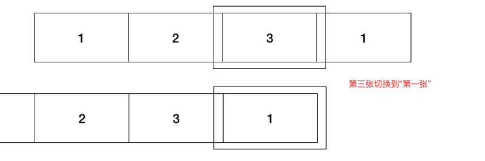
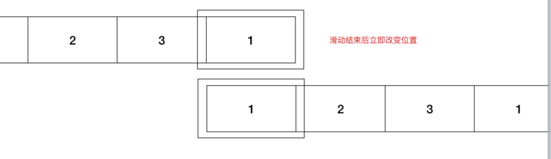

## 原理



当滑动完第三张图片后，紧接着下一张是重复的1。



滑动结束的之后，立刻将最后的1用最前面的1进行替代，从而达到循环轮播的目的。在我的实现中，还包括了用手触摸滑动的功能，可以向左和向右，因此最前面也多出了一张图片3。


## 构建基本布局

```html
// swiper.html
<!DOCTYPE html>
<html lang="en">
<head>
    <meta charset="UTF-8">
    <title>Swiper</title>
    <link rel="stylesheet" href="swiper.css">
</head>
<body>
    <div class="container">
    	<div class="wrap" style="left: -8rem">
    		
    		
    		
    		
    		
    	</div>
    </div>
    <script src="swiper.js"></script>
</body>
</html>
```

这个是基本的html布局，说明一下为什么第一个img的src是3.jpg和最后一个img的src是1.jpg，这是为了循环轮播，后面会给出解释。style=left: -8rem也会再下面的CSS布局中给出解释。接下来先把CSS样式实现一下。


## CSS样式

```css
html {
	font-size: 75px;
}

.container {
	width: 8rem;
	height: 5.3rem;
	margin: auto;
	position: relative;
	background-color: #eee;
	overflow: hidden;
}

.wrap {
	width: 40rem;
	height: 5.3rem;
	position: absolute;
}

img {
	float: left;
	width: 8rem;
	height: 5.3rem;
}

```

首先设置了html根元素的font-size为75px，之所以这么设计是因为想采用基于flexible自适应的思想，这和rem这个单位有关系，具体关系可以参考我写的关于rem的文章。简单说一下就是，1rem就等于根元素下设置的font-size的值，即1rem=75px。这样下面的css也很好理解了，首先来看img是浮动的，这是因为我们希望要呈现的图片都在一行，仅通过设置img外层元素wrap的left值来展现不同的图片，记住这里的float目的就是让图片都显示在一行上。width=8rem这个是随意设置的，原先我是设置成600×400大小的图片，后来想实践一下rem的用法，换算一下就是8rem了（600/75），同理height也是，sublime下可以下载cssrem插件，只需要输入px就可以快速得到rem值，不需要每次自己计算。wrap的宽度是5张图片宽度的总和，这样宽度足够，float的元素才能在同一行，height和imgheight一致即可，position为absolute，这是相对于container对应元素而言的，不懂position的也可以参考我的css学习笔记这篇文章。container是最外层的div，width=8rem，这是因为我们希望每次只能看见一张图，所以宽度和一张图片的宽度一致即可，高度也是，overflow: hidden可以将其余的都隐藏起来，margin: auto可以快速实现水平居中，position设置为relative，relative的位置是相对与自身位置而言的，必须要设置该元素的position为relative，否则wrap对应元素的absolute就是基于根元素布局的了。讲到这里就应该能理解上面html文件中，为何style=“left: -8em”了吧，这是因为我们希望从1.jpg开始显示，而3.jpg才是第一个子元素，因此将wrap向左移动一个img的宽度，那么展示的就是1.jpg，即第二个子元素了。不懂的可以一步一步的试着敲一遍代码。


## 逻辑实现

### 定时滚动图片

这是最基本的要求，用户和轮播图没有任何交互，仅仅是轮播图自己变动。

```js
var wrap = document.querySelector(".wrap")

function setTimer() {
	return setInterval(function() {
		var tmp = parseInt(wrap.style.left) - 8
		wrap.style.transition = "left, 1s"
		wrap.style.left = tmp + "rem"
	}, 3000)
}

var timer = setTimer()
```

这个setInterval的作用就是，每隔3秒，将wrap对应的元素的left减去8rem，即一个图像的宽度，以此来显示下一张照片。wrap.style.transition = "left, 1s"就是说关于left属性值的变化，在1s内完成，而不是瞬间就完成，这样字子就可以有一个过渡的效果。可以看到，如果显示到最后一张照片了，我们就应该回到开始，因此添加一下代码：

```js
wrap.addEventListener('webkitTransitionEnd', function () {
	console.log('transition end')
	if (parseInt(wrap.style.left) === -32) {
		wrap.style.left = -8 + "rem"
		wrap.style.transition = "left, 0s"
	} else if (parseInt(wrap.style.left) === 0) {
		wrap.style.left = -24 + "rem"
		wrap.style.transition = "left, 0s"
	}
})
```

写到这里，可能会有一些疑问，为什么对最后一张图片的处理要放在webkitTransitionEnd事件上呢？放在setInterval上不行吗？代码为什么这么写？看到网上很多轮播图的实现，都是很简单的，有些没有涉及到过渡的效果，有些没有人手滑动的交互（下面我会介绍到），如果要有过渡的效果，那么在setInterval中判断是否达到最后一张图片，然后做出相应的处理时会有一些问题，例如我们这么写：

```js
var wrap = document.querySelector(".wrap")

function setTimer() {
	return setInterval(function() {
		var tmp = parseInt(wrap.style.left) - 8
        if (tmp === -32) {
            wrap.style.left = -8 + "rem"
            wrap.style.transition = "left, 1s"
        } else if (tmp === 0) {
            wrap.style.left = -24 + "rem"
            wrap.style.transition = "left, 1s"
        } else {
            wrap.style.transition = "left, 1s"
            wrap.style.left = tmp + "rem"   
        }
	}, 3000)
}

var timer = setTimer()
```

这么写的话，就是说，当下一张图片是最后一个子元素1.jpg时，就将wrap.style.left的值置为-8，即显示第二个子元素1.jpg时候的值，那么这个时候就可以不用重复写多一个src为1.jpg的img了（文章一开始产生的疑问），其实这是不正确的，也就是说展示完最后一张图片之后，left值从-24直接变到-8，并且这个过程在1s内完成，这样的话过渡要过就相当于图片从尾向前平移了，大家可以通过上述代码尝试一下，这和我们平时看见的轮播图有些不一样，很不自然，我们希望的时，当播放完最后一张图片时，回到第一张的时候，也和之前的过渡一样。因此就要像先前代码一样，而写在webkitTransitionEnd事件上的原因，其实和实现轮播图的原理有关，回看上述原理分析，我们希望通过在3.jpg后面增加一个1.jpg，这样最后一张图片回到第一张图片的过渡就和之前效果一样了，而不是一个往回平移的过程，但是到最后的1.jpg之后，wrap.style.left就不应该再减8了，而应该变回显示第一张图片（1.jpg）时的值，这样setInterval再减8的时候，才会显示下一张图，从而达到循环轮播。将wrap.style.left的值重置的过程必须放在webkitTransitionEnd中，因为这个时候，transition的过程才完成，你不能在transition之前就进行重置，重置的时候transition: left 0s，这个0s是必须的，因为此时left从-32变为-8这个过程，你是不想让用户进行感知的，-32和-8时，显示的都是1.jpg，所以0s的话，就是说瞬间变换，这样是没有过渡效果的。通过上述解释，再结合文章开头所说的原理，就能弄清楚为什么我们要增加一个重复的图片进行轮播，第一个子元素3.jpg同理，这是用来手动滑动轮播图时，循环用的。


## 当鼠标在轮播图上的时候，停止轮播；移开后，恢复轮播

```js
wrap.addEventListener('mouseover', function() {
	console.log('mouse over')
	clearInterval(timer)
})

wrap.addEventListener('mouseleave', function() {
	console.log('mouseleave');
	timer = setTimer()
})
```

这个很简单，只需要为鼠标的over和leave事件绑定回调函数，清除计时器或恢复计时器即可


## 手触摸滑动轮播图

```js
var startX = endX = null
var position;
wrap.addEventListener('touchstart', function (e) {
	console.log('touch start')
	clearInterval(timer)
	startX = e.touches[0].pageX
	position = parseInt(wrap.style.left);
})

wrap.addEventListener('touchmove', function (e) {
	// console.log('touch move')
	endX = e.touches[0].pageX
	wrap.style.transition = 'left, 0s'
	wrap.style.left = position - (startX - endX) / 75 + 'rem'
	if (parseInt(wrap.style.left) <= -32) {
		wrap.style.left = -8 + 'rem'
		position = parseInt(wrap.style.left)
		startX = endX
	} else if (parseInt(wrap.style.left) >= 0) {
		wrap.style.left = -24 + 'rem'
		position = parseInt(wrap.style.left)
		startX = endX
	}
})

wrap.addEventListener('touchend', function (e) {
	console.log('touch end')
	// console.log(startX, endX)
	wrap.style.transition = "left, 1s"
	if (startX - endX > 100 && endX != null) {
		wrap.style.left = position - 8 + "rem"
	} else if (startX - endX < -100 && endX != null) {
		wrap.style.left = position + 8 + "rem"
	}
	timer = setTimer()
	startX = endX = null
})
```

startX是记录滑动前，手指点击屏幕的位置；endX是移动时，手指点击屏幕的位置；position记录的时开始移动前，wrap.style.left的值。touchstart即滑动开始前，我们需要记录startX的值，并且清除计时器。touchmove则需要我们做的时，移动过程中，手指没有离开的话，轮播图应该移动一定的距离，这是通过wrap.style.left = position - (startX - endX)实现的，要注意设置wrap.style.transition = 'left, 0s'，否则移动的过程中会很难拖动，因为每个变换都需要1s进行完成。紧跟的if else是解决边界问题，这也是个难点，但解决思路和之前循环轮播是一样的，样设置startX = endX，否则，当wrap.stytle.left从-32变成-8之后，startX - endX > 100就会执行下面touchend的逻辑，进行向左移动，这显然是不正确的，可以尝试着更改代码测试一下，这里需要注意的是当滑动的太快时，transitionend事件只有当你停止之后才会触发，在一直滑的过程是不会触发的，因此要在touchmove中处理边界问题。最后就是touchend了，就是结束滑动的时候，我们需要判断一下startX - endX的值，否则移动距离太小可能只是用户无意间的行为，我们不希望进行滑动，还有就是endX为null的判断， 这是因为每次结束后都会对startX和endX进行置null的操作，否则会出现一个bug，就是，当你第一次滑动之后，startX和endX的值会保留，这个时候你点击一下轮播图的位置，会触发touchStart得到新的startX，但是不会触发touchmove，那么这个新的startX就会和旧的endX进行作差，在touchend事件中，进行图片的滑动，因此，为了解决这个bug，我将其置为了null。