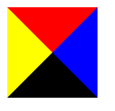
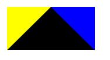
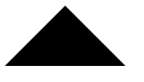
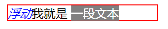
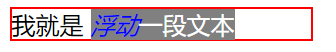
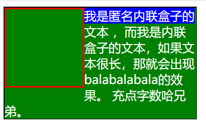
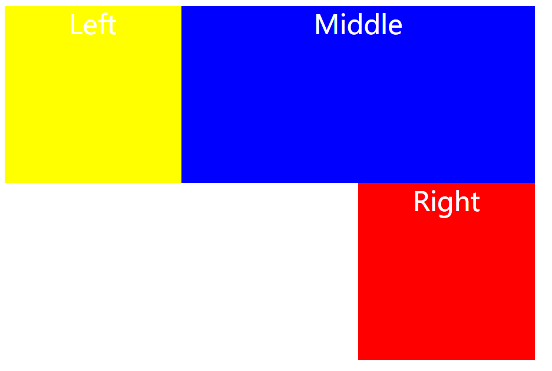
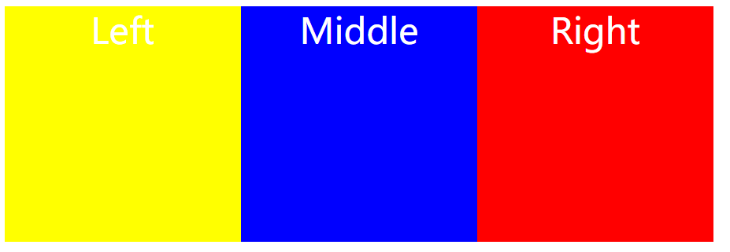
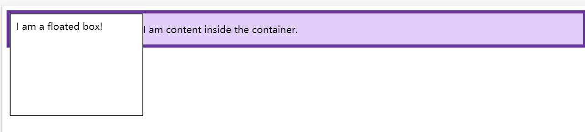

## Position

### static

- 是html定位的默认值，不会收到top、bottom、left、right的影响


### fixed

- 元素相对于浏览器窗口的位置
- 与文档流无关，因此不占据空间，它会和其他元素发生重叠


### relative

- 相对自己的正常位置

- 相对元素的内容移动了，但是预留空间的元素仍然保存在正常流动，也就是说相对移动之后，不会对下面的其他元素造成影响


### absolute

- 绝对定位的元素相对于最近的已定位父元素，如果元素没有已定位的父元素，那么它的位置相对于\<html\>


### sticky

- 在屏幕范围（viewport）时该元素的位置并不受到定位影响（设置是top、left等属性无效），当该元素的位置将要移出偏移范围时，定位又会变成fixed，根据设置的left、top等属性成固定位置的效果


### 重叠的元素—z-index

- 仅能在定位元素上生效
- z-index越大，处在堆叠顺序越前
- 父子元素同为正时，即使父元素z-index大于子元素，也不会生效。当子元素z-index为负时，没有设置父元素，此时父元素才会在子元素上方，如果设置了父元素z-index，也不会生效
- 参考：https://www.cnblogs.com/zhuzhenwei918/p/6112034.html


### 脱离文档流导致的问题

- 子元素无法撑开父元素
  - 在js中设置父元素高度等于子元素的高度
  - 给父元素强行设置高度


## 盒子模型

### w3c标准的盒子模型


### IE6一下的盒子模型


### 浏览器的兼容性问题

浏览器选择哪个盒模型，主要看浏览器处于标准模式（Standards Mode）还是怪异模式（Quirks Mode）。我们都记得**<!DOCTYPE>**声明吧，这是告诉浏览器选择哪个版本的HTML，**<!DOCTYPE>**后面一般有DTD的声明，如果有DTD的声明，浏览器就是处于标准模式；如果没有DTD声明或者HTML4一下的DTD声明，那浏览器按照自己的方式解析代码，处于怪异模式。处于标准模式的浏览器（IE浏览器版本必须是6或者6以上），会选择W3C盒模型解析代码；处于怪异模式的浏览器，则会按照自己的方式去解析代码，IE6以下则会是选择IE盒模型，其他现代的浏览器都是采用W3C盒模型。


# margin外边距

- 使用百分数时是相对于父元素的width。上下边距也是一样，正常流中大多数元素都会足够高以包含其后代元素(包括外边距)，因此如果上下边距以父元素的heigt进行设置，就会导致父元素height变化，那么子元素margin也变化，循环反复。对于定位元素，上下外边距如果是百分数，会有所区别。
- 正常流中垂直相邻外边距会合并（BFC解决）。
- 块元素负边距会增大content宽度。
- 对行内元素使用上下外边距没有任何视觉效果，是因为外边距对行高没有影响。注意行内元素跨行的时候，仅对设置了外边距的元素的头尾有作用，并不是对跨行的内容都有作用。设置负边距会使左右两端内容重合。
- 为行内替换元素设置上下边距有影响，会导致行高增加或减少。


## CSS画三角形原理

当content的高度、宽度为0时，设置border的颜色、宽度、样式

```html
<!DOCTYPE html>
<html lang="en">
<head>
    <meta charset="UTF-8">
    <title>triangle</title>
    <style>
        .triangle {
            height: 0px;
            width: 0px;
            border-color: red blue black yellow;
            border-width: 50px;
            border-style: solid;
        }
    </style>
</head>
<body>
    <div class="triangle"></div>
</body>
</html>
```



当其中一边的border为0时，可以看见元素总的高度就变为50px。

```html
<!DOCTYPE html>
<html lang="en">
<head>
    <meta charset="UTF-8">
    <title>triangle</title>
    <style>
        .triangle {
            height: 0px;
            width: 0px;
            border-color: red blue black yellow;
            border-width: 0px 50px 50px 50px;
            border-style: solid;
        }
    </style>
</head>
<body>
    <div class="triangle"></div>
</body>
</html>
```



将两边的border颜色设为transparent，就可以得到一个黑色三角形

```html
<!DOCTYPE html>
<html lang="en">
<head>
    <meta charset="UTF-8">
    <title>triangle</title>
    <style>
        .triangle {
            height: 0px;
            width: 0px;
            border-color: red transparent black transparent;
            border-width: 0px 50px 50px 50px;
            border-style: solid;
        }
    </style>
</head>
<body>
    <div class="triangle"></div>
</body>
</html>
```




## 垂直居中div的方法

### 固定宽高

将其Position设为absolute脱离文档流，然后就可以通过top和left来设定div的位置，注意基准点是div的左上角，因此要往左和往上移动一般的div宽高

```html
<!DOCTYPE html>
<html lang="en">
<head>
    <meta charset="UTF-8">
    <title>center</title>
    <style>
        #box {
            width: 100px;
            height: 100px;
            position: absolute;
            left: 50%;
            top: 50%;
            margin-left: -50px;
            margin-top: -50px;
            background-color: red;
        }
    </style>
</head>
<body>
    <div id="box">box</div>
</body>
</html>
```

### 有父元素且box高度固定

1.在普通内容流中，margin:auto的效果等同于margin-top:0;margin-bottom:0。

2.position:absolute使绝对定位块跳出了内容流，内容流中的其余部分渲染时绝对定位部分不进行渲染。

3.为块区域设置top: 0; left: 0; bottom: 0; right: 0;将给浏览器重新分配一个边界框，此时该块块将填充其父元素的所有可用空间，所以margin 垂直方向上有了可分配的空间。

4.再设置margin 垂直方向上下为auto，即可实现垂直居中。（注意高度得设置）。

```html
<!DOCTYPE html>
<html lang="en">
<head>
    <meta charset="UTF-8">
    <title>center</title>
    <style>
        .father{
            height: 500px;
            position: relative;
            border: solid 1px black;
        }
        .box{
            height: 100px;
            position: absolute;
            left: 0;
            top:0;
            right:0;
            bottom: 0;
            margin:auto 0;
            background-color: red;
        }
    </style>
</head>
<body>
    <div class="father">
        <div class="box">box</div>
    </div>
</body>
</html>
```

### 有父元素且box高度不固定

```html
<!DOCTYPE html>
<html lang="en">
<head>
    <meta charset="UTF-8">
    <title>center</title>
    <style>
        .father{
            width: 500px;
            height: 500px;
            border: solid 1px black;
        }
        .box{
            width: 100px;
            position: relative;
            left: 50%;
            top: 50%;
            transform: translateX(-50%) translateY(-50%);
            background-color: red;
        }
    </style>
</head>
<body>
    <div class="father">
        <div class="box">box</div>
    </div>
</body>
</html>
```

translate会根据自身宽高的百分比进行平移

### 弹性布局

```html
<!DOCTYPE html>
<html lang="en">
<head>
    <meta charset="UTF-8">
    <title>center</title>
    <style>
        .father{
            width: 200px;
            height: 300px;
            border: solid 1px black;
            display: flex;
            justify-content: center;
            align-items: center;
        }
        .box{
            width: 100px;
            height: 100px;
            background-color: red;
        }
    </style>
</head>
<body>
    <div class="father">
        <div class="box">box</div>
    </div>
</body>
</html>
```

justify-content设置主轴上的排列方式（默认水平），align-items设置在交叉轴上排列方式（若flex-direction=row，交叉轴则为纵轴）

### table布局

```html
<!DOCTYPE html>
<html lang="en">
<head>
    <meta charset="UTF-8">
    <title>center</title>
    <style>
        .wrapper{
            width: 500px;
            height: 500px;
            border: solid 1px black;
            display: table;
        }
        .cell{
            display: table-cell;
            vertical-align: middle;
            text-align: center;
        }
        .box{
            width: 100px;
            height: 100px;
            background-color: red;
            display: inline-block;
        }
    </style>
</head>
<body>
    <div class="wrapper">
        <div class="cell">
            <div class="box">box</div>
        </div>
    </div>
</body>
</html>
```

子盒模型display为inline-block


## 关于float

关于float，看到一篇文章，有两点是需要注意的，分别是：

- 确定“包含块”
- 在“当前行”进行浮动

### 确定“包含块”

```html
<!DOCTYPE html>
<html lang="en">
<head>
	<meta charset="UTF-8">
	<title>float</title>
</head>
<style>
	.box {
		border: 1px solid red;
		width: 200px;
		margin-left: 50px;
	}
	.text {
		background-color: gray;
		color: white;
	}
	.float {
		float: left;
		color: blue;
	}
</style>
<body>
	<div class="box">
		我就是
		<span class="text">一段文本<em class="float">浮动</em></span>
	</div>
</body>
</html>
```

这段代码的运行结果是这样的



为什么”浮动“二字去到了最左边？而不是在“一段文本”的右边？这是因为W3C的CSS标准文档定义的：一个浮动盒会向左或向右浮动，直到外边界挨到包含块的边界。接下来讲讲包含块的定义：

- 根元素所在的包含块叫初始包含块 initial containing block。对于连续媒体设备（continuous media），初始包含块的大小等于视口viewpor的大小，基点在画布的原点（视口左上角）；对于分页媒体（paged media），初始包含块是页面区域（page area）。初始包含块的direction属性与根元素的相同。
- 对于其他元素，如果元素的position属性是relative或static，他的包含块是由最近的祖先块容器盒（block container ancestor box）的内容区域（content edge：width属性和height属性确定的区域）创建的。

- 如果一个元素的position属性为fixed，他的包含块由视口创建（连续媒体）或者由页面区域创建（paged media）。
- 如果元素的position为absolute，他的包含块由最近的position不为static的祖先元素创建，具体创建方式如下：
  - 如果创建包含块的祖先元素是行内元素（inline element），包含块的范围是这个祖先元素中的第一个和最后一个行内盒的padding box围起来的区域。
  - 如果这个祖先元素不是行内元素，包含块的范围是这个祖先元素的内边距+width区域

在我这个例子中，”浮动“所在的em元素的包含块就是class为box的div，因为span不是块容器盒，因此它的浮动是基于外层div的。如果我们为span添加一个display: inline-block的样式，那么情况就变成如下了：



还有一个问题就是，为什么”浮动“会在”一段文本“的左侧？这个和文字环绕的原因是一致的，即重叠区不允许渲染”内容“，看看以下例子：

```js
<style>
    .container{
        width:250px;
        border:1px solid black;
    }
    
    .float {
        float:left;
        width: 100px;
        height:100px;
        border:2px solid red;
    }
    .paragraph {
        background-color:green;
        color:white;
    }
    
    .paragraph:first-line {
        background-color:blue;
    }
    
</style>
<div class='container'>
    <div class='float'></div>
    <div class='paragraph'>
        我是匿名内联盒子的文本
        <span>，而我是内联盒子的文本，如果文本很长，那就会出现balabalabala的效果。
        </span>
        充点字数哈兄弟。
    </div>
</div>
```



这里的class为float的div所在的区域就是重叠区域，是不允许渲染内容的，因此文字被卡到了右边，实现了环绕。


## 在”当前行“进行浮动

什么是当前行？看看下面例子：

```html
<style>
    .container {
        width: 600px;
        color:white;
        text-align:center;
        font-size:30px;
    }
    .left {
        float:left;
        background-color:yellow;
        width:200px;
        height:200px;
    }
    .right {
        float:right;
        background-color:red;
        width:200px;
        height:200px;
    }    
    
    .middle {
        height: 200px;
        margin: 0 auto;
        background-color:blue;
    }
    
</style>
<div class='container'>
    <div class='left'>Left</div>
    <div class='middle'>Middle</div>
    <div class='right'>Right</div>
</div>
```

运行的结果如下：



这个例子我是希望left、middle、right在同一行，并且Middle通过margin:0 atuo实现自适应居中，但是right却到了第二行。原理很简单，每个div都占据一行，left是第一个div元素，当设置了float之后，脱离了文档流，middle就变成了第一行了，right就变成了第二行，此时right也设置了float，但它的当前行是第二行，因此就显示在了left和midle的下方。如果我们将right的div移到left之后，即可，代码如下：

```html
<style>
    .container {
        width: 600px;
        color:white;
        text-align:center;
        font-size:30px;
    }
    .left {
        float:left;
        background-color:yellow;
        width:200px;
        height:200px;
    }
    .right {
        float:right;
        background-color:red;
        width:200px;
        height:200px;
    }    
    
    .middle {
        height: 200px;
        margin: 0 auto;
        background-color:blue;
    }
    
</style>
<div class='container'>
    <div class='left'>Left</div>
    <div class='right'>Right</div>
    <div class='middle'>Middle</div>
</div>
```

运行结果就变到了这样：




### 参考文章

https://segmentfault.com/a/1190000018357496


## BFC（块格式化上下文）

### BFC的创建方法

- 根元素
- float值不为none
- position为absolute或fixed
- display: inline-block
- display: table-cell
- overflow不为visible
- display: flex | inline-flex

### 通过一些情况来认识BFC

#### 父元素高度坍塌

```html
<style>
.box {
  background-color: rgb(224, 206, 247);
  border: 5px solid rebeccapurple;
}

.float {
  float: left;
  width: 200px;
  height: 150px;
  background-color: white;
  border:1px solid black;
  padding: 10px;
}    
</style>  
<div class="box">
    <div class="float">I am a floated box!</div>
    <p>I am content inside the container.</p>
</div>

```



div标签通过float: left生成了一个BFC，因此父元素的高度发生了坍塌。解决这个问题的方法就是，令父元素也生成一个BFC，通常的做法是overflow: hidden，这样BFC就会计算其所有子元素的高度。

#### 外边距合并

```html
<style>
.blue, .red-inner {
  height: 50px;
  margin: 10px 0;
}

.blue {
  background: blue;
}

.red-outer {
  overflow: hidden;
  background: red;
} 
</style>  
<div class="blue"></div>
<div class="red-outer">
  <div class="red-inner">red inner</div>
</div>

```

常见的外边距合并的情况

- 正常流中垂直相邻的两个块元素
- 父元素中如果如果在父元素与其第一个子元素之间不存在边框、内边距、行内内容，也没有创建块级上下文或者清除浮动将两者的margin-top分开

在这个情况下，overflow: hidden创建了BFC，因此父元素和第一个子元素的margin-top分开了，因此不会造成外边距合并。

### 谈谈BFC的作用（待补充）

- BFC就是页面上的一个隔离的独立容器，容器里面的子元素不会影响到外面的元素，反之亦然


## CSS动画

### 属性

- animation-name: keyframe名称
- animation-duration: 动画花费的时间
- animation-timing-function: 规定动画速度曲线
  - linear：速度不变
  - ease：低速开始、加速、低俗结束
  - ease-in
  - ease-out
  - ease-in-out
  - cubic-bezier(n, n, n, n)
- animation-delay: 延迟开始
- animation-iteration-count：规定播放次数
  - infinite
  - \<integer\>
- animation-direction：是否轮流反向播放
  - normal：默认值，正常播放
  - alternate：轮流反向播放
  - reverse
- animation-fill-mode: none | forwards | backwards | both
  - none之后不改变任何样式
  - forwards保持动画最后一帧
  - backwards保持动画第一帧
  - both将会执行forwards和backwards的状态
- animation-play-state: running | paused

### keyframe

缺省的值突然出现不是渐变的

```html
@keyframe animationName
	<percentage> { some attribute }
```

from等效于0%

to等效于100%

### transition

transition: <property\> <duration\> <animation type\> <delay\>

- transition-property: none | all | property
  - none时没有属性变化
  - all为所有属性变化
  - property即指定属性值，常见属性值有：
    - color: 背景颜色、边框颜色等
    - length: 包括一些宽高等
- transition-duration:  \<time\>
  - 指定元素转换的时间，可以用于所有元素，包括伪元素
- transition-timing-function:  和animation类似
- transition-delay

### transition和animation的一些区别

- animation控制动画阶段的粒度更细，可以通过keyframe指定每个阶段
- animation对性能要求较高。[性能探究](<http://zencode.in/18.CSS-animation%E5%92%8Ctransition%E7%9A%84%E6%80%A7%E8%83%BD%E6%8E%A2%E7%A9%B6.html>)
- animation不需要触发事件，而transition需要

### transform


## 伪元素和伪类

### 伪类

一个CSS伪类是一个以冒号(:)作为前缀，被添加到一个选择器末尾的关键字，它可以使得dom节点在特定 状态下呈现特定样式。

常见的伪类选择器有：

链接伪类：

- :link
- visited

动态伪类：

- :active
- :hover

选择第一个子元素：

- :first-child
  - :first-child容易出现一些理解上的问题，例如: ul li:first-child，并不是指li的第一个子元素，而是ul中第一个li元素。

根据语言选择：

- :lang()
  - 语言可能来自lang属性和META元素的组合

详见[伪类和伪元素](<https://developer.mozilla.org/zh-CN/docs/Learn/CSS/Introduction_to_CSS/Pseudo-classes_and_pseudo-elements>)。

使用伪类改变锚或其他节点大小时，会带来重绘的问题，因此要注意。

可以结合使用伪类，但不能冲突，例如一个锚不能既是以访问又是未访问，因此`a​:link:​visiten`就是毫无意义的。

### 伪元素

伪元素能在文档中插入假想的元素，带来一些样式的改变。它的前缀是两个冒号(::)。

设置首字母：

- ::first-letter

设置第一行的样式：

- ::first-line

设置之前之后的元素的样式（可以用content属性插入内容）：

- ::before
- ::after

一个选择器只能使用一个伪元素且伪元素选择器应该放在元素选择器的最后面。

### 伪元素和伪类区别

- 伪类可以理解为弥补常规CSS选择器的不足
- 伪元素更倾向于创建一个有内容的虚拟容器
- 可以同时使用多个伪类，但是只能同时使用一个伪元素


## CSS优先级

ID选择器 > 伪类 > 属性选择器 > 类选择器 > 元素选择器 > 通用选择器(*)

内敛样式 > 嵌入引用 > 外部引用


## Flex布局

Flex布局默认有两个轴：水平主轴和垂直交叉轴。

### 容器属性

- flex-direction：row | row-reverse | column |column-reverse
  - 设置主轴方向
- flex-wrap:  nowrap | wrap | wrap-reverse
  - 默认情况下，所有的item(子元素)都在一根轴上。可以设置wrap进行换行。
- flex-flow: \<flex-direction\> || \<flex-wrap\>
  - 这是flex-direction和flex-wrap的简写，默认为 row nowrap。
- justify-content：flex-start | flex-end | center | space-between | space-around
  - 设置主轴上item的对齐方式。space-between的首尾在容器的始末位置，space-around为每个元素分配相同空间。
- align-item：flex-start | flex-end | center | baseline | stretch
  - 设置交叉轴上item的对齐方式。baseline指item中第一行文字的基线对齐。stretch如果item没有设置高度或者高度为auto，将占满整个容器。

### Item属性

- order: \<integer\>
  - 默认为0。数值越小，排列越靠前。
- flex-grow: \<numer\>
  - 默认为0。定义item的放大比例，为0时，即使存在空余空间也不放大。如果所有item的flex-grow为1，则等分空间；如果其中一个为2，那么这个item比其他item空间大一倍。
- flex-shrink：\<numer\>
  - 默认为1。定义item 的缩小比例。为1时，当空间不足，将等比例缩小。如果其他item该属性为0，其中一个为1，空间不足时，前者不缩小。
- flex-basis：\<length\> | auto
  - 设置item占据主轴的空间，默认值为auto，即项目本来大小。可以设置width或height值，则项目占据固定空间。
- flex: none | [ <'flex-grow'> <'flex-shrink'>? || <'flex-basis'> ]
  - 是flex-grow, flex-shrink 和 flex-basis的简写，默认值为0 1 auto。后两个属性可选。
  - 该属性有两个快捷键：auto (1 1 auto) 和 none (0 0 auto)
- align-self： auto | flex-start | flex-end | center | baseline | stretch
  - 允许单个项目有与其他项目不一样的对齐方式，可覆盖align-items属性
  - 默认值为auto，即继承父元素的align-items属性，如果没有父元素，则等同于stretch。


## 块级元素和行内元素

### 块级元素

- 独占一行
- 可以设置宽高，如果不设置宽度，默认为父级元素宽度的100%
- div、p、h、ul、table、form

### 行内元素

- 与其他行内元素共处一行
- 不能设置宽高，宽度默认为文字的宽度
- span、a、img、input、textarea、select

### 块级元素和行内元素的转换

- display: inline转换成行内元素
- display: block转换成块级元素


## 继承属性

### 可继承属性

字体系列属性

- font
- font-family
- font-weight
- font-size
- font-style

文本系列

- text-indent
- text-align
- line-height
- direction
- color
- text-transform
- word-spacing
- letter-spacing

元素可见性：

- visibility

列表布局属性：

- list-style-type

### 不可继承的属性

- diplay

文本系列

- vertical-align
- text-decoration

盒子模型属性

背景属性

定位属性

生成内容属性：content

轮廓样式属性：outline