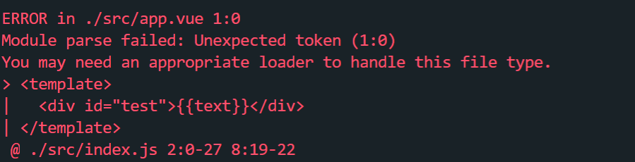

## 创建项目文件夹

- `mkdir vue-ssr-review`
- `npm init`会在vue-ssr-review文件夹中生成一个package.json文件
- `npm i webpack vue vue-loader`，安装完vue-loader后，终端会有个warn，告诉我们使用vue-loader还需要安装css-loader，因此还要执行`npm i css-loader`


## 创建第一个vue文件

- `mkdir src`
- 在src文件夹下新建一个app.vue文件

```js
<template>
  <div id="test">{{text}}</div>
</template>

<script>
export default {
	data () {
		return {
			text: 'abc'
		}
	}
}
</script>

<style>
#test {
	color: red;
}
</style>
```

- 在src文件夹下新建一个index.js文件

```js
import Vue from 'vue'
import App from './app.vue'

const root = document.createElement('div')
document.body.appendChild(root)

new Vue({
  render: (h) => h(App)
}).$mount(root)
```

- 在根目录下新建一个webpack.config.js文件

```js
const path = require('path')

module.exports = {
	entry: path.join(__dirname, 'src/index.js'),
	output: {
		filename: 'bundle.js',
		path: path.join(__dirname, 'dist')
	}
}
```

- 在package.json文件中添加build命令

```js
{
  "name": "vue-ssr-review",
  "version": "1.0.0",
  "description": "",
  "main": "index.js",
  "scripts": {
    "test": "echo \"Error: no test specified\" && exit 1",
    "build": "webpack --config webpack.config.js"
  },
  "author": "",
  "license": "ISC",
  "dependencies": {
    "css-loader": "^2.1.0",
    "vue": "^2.6.3",
    "vue-loader": "^15.6.2",
    "webpack": "^4.29.3"
  },
  "devDependencies": {
    "webpack-cli": "^3.2.3"
  }
}

```

- 运行`npm run build`，终端会先提示安装webpack-cli，运行`npm i -D webpack-cli`，有可能会出现Unexpected end of input的问题，这个时候就要先清除npm缓存，`npm cache clean --force`。然后再安装webpack-cli，又会出现Error: EPERM: operation not permitted的问题，这是因为我们清除了缓存之后，要再次安装所需的npm包，运行`npm install`，安装完成后再安装webpack-cli即可。
- 运行`npm run build`会要求我们指定webpack运行模式，在wepack.config.js中添加mode: 'production'。还会出现以下报错。



- 这是因为webpack是只能解析js文件，要解析.vue文件必须在webpack.config.js中添加使用vue-loader检查.vue文件规则和vue-loader插件。运行build还是有问题，出现在样式上，还要添加使用vue-style-loader和css-loader处理css的规则，可以查看vue-loader官方文档。（如果还有问题，就是webpack.config.js打错字）

```js
const path = require('path')

const VueLoaderPlugin = require('vue-loader/lib/plugin')

module.exports = {
	mode: 'production',
	entry: path.join(__dirname, 'src/index.js'),
	output: {
		filename: 'bundle.js',
		path: path.join(__dirname, 'dist')
	},
	module: {
		rules: [
			{
				test: /\.vue$/,
				loader: 'vue-loader'
			},
			{
        		test: /\.css$/,
        		use: [
          			'vue-style-loader', // 将css文件动态插入html中
          			'css-loader' // 处理成css文件
        		]
      		}
		]
	},
  plugins: [
    // 请确保引入这个插件！
    new VueLoaderPlugin()
  ]
}
```

- build成功后可以看见根目录生成了一个dist文件夹，这个是webpack.config.js中ouput指定的path，里面有一个bundle.js文件

- 添加url-loader规则处理图片。比limit小的图片都会将其图片数据转换成base64url的格式
  - 优点：减少http请求
  - 缺点：仅适用于较小的图片，较大的图片转换出来的base64url字符串会很大，这个字符串是嵌套在css文件中的，从而导致css文件较大，从而使加载css代价大于多出来的http请求。
  - 能够减少http请求的原因是图片base64url是通过图片数据编码得到的，因此可以通过base64url解码获得图片，无需像普通url一样通过http请求获取图片
  - 参考阅读：
    - https://www.npmjs.com/package/url-loader
    - https://segmentfault.com/a/1190000011487980
    - https://www.zhangxinxu.com/wordpress/2012/04/base64-url-image-%E5%9B%BE%E7%89%87-%E9%A1%B5%E9%9D%A2%E6%80%A7%E8%83%BD%E4%BC%98%E5%8C%96/
    - https://segmentfault.com/q/1010000002573728

```js
const path = require('path')

const VueLoaderPlugin = require('vue-loader/lib/plugin')

module.exports = {
	mode: 'production',
	entry: path.join(__dirname, 'src/index.js'),
	output: {
		filename: 'bundle.js',
		path: path.join(__dirname, 'dist')
	},
	module: {
		rules: [
			{
				test: /\.vue$/,
				loader: 'vue-loader'
			},
			{
        test: /\.css$/,
        use: [
          'vue-style-loader', // 将css文件动态插入html中
          'css-loader' // 处理成css文件
        ]
			},
			{
				test: /\.(gif|jpg|jpeg|png|svg)$/,
				use: [
					{
						loader: 'url-loader',
						options: {
							limit: 1024
						}
					}
				]
			}
		]
	},
  plugins: [
    // 请确保引入这个插件！
    new VueLoaderPlugin()
  ]
}
```

