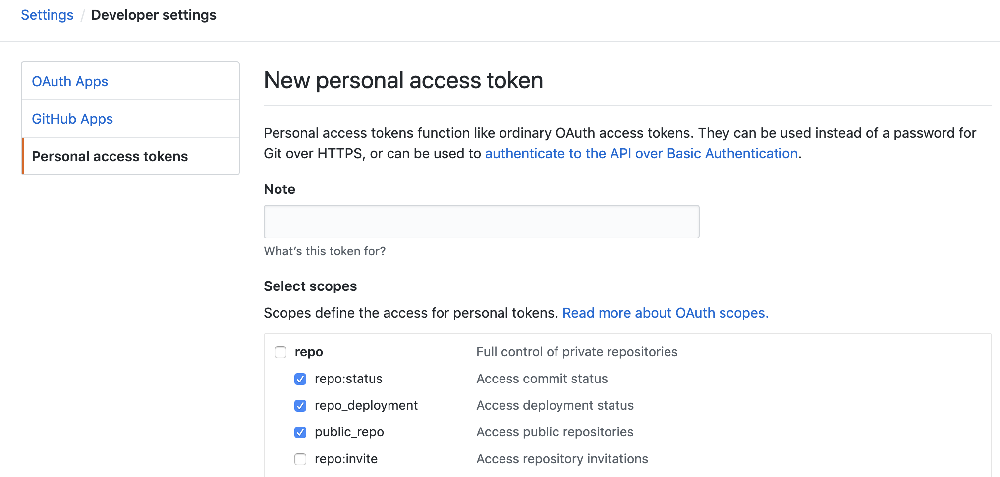

# 用Travis CI自动部署Vuepress博客

## Gihub中生成personal access token



## 准备Travis命令行工具

- `ruby -v`检查是否有ruby环境
- `gem install travis`
- `travis login`，输入你的github用户吗和密码。

- `travis encrypt -r <github name>/<github repo> GH_Token=XXX`，其中GH_Token为刚刚在github生成的token。

加密之后终端会生成加密的信息，将其复制粘贴进`.travis.yml`中：

```
env:
 global:
   - GIT_PAGE_REF: github.com/Limsanity/Limsanity.github.io.git
   - secure: "<第4步生成的加密key>"
```

## 完整的配置文件

```
language: node_js
node_js: stable

cache:
  directories:
    - node_modules

install:
  - npm install

script:
  - npx vuepress build blog

after_script:
  - cd blog/.vuepress/dist
  - git init
  - git add -A
  - git commit -m 'deploy'
  - git push --force --quiet "https://${GH_Token}@${GIT_PAGE_REF}" master:master

env:
  global:
    - GIT_PAGE_REF: github.com/Limsanity/Limsanity.github.io.git
    - secure: "N0b+d6rlYLAH5fJeJIiZkwt4w0VKEwiirLjyV8DQvqOC3I4MCoGiMO0U9ROvbsvGee9rNlePbVgvItaDOYXfb1dFbCrJN/IgHR+HfiXelwE2PlgrMNYChi5O0MF/qTHv2T/yhGRm9p1cA/pl/kbRVoWXNnkLhQ0+QMGGjrAaSbrb3X0Qepbb8YrcfCpa++jBZHs7h5I7pNAmzT8ZHdVa2EUGSJ3PyuHzsiEss/Qwc883UHUoU4zNt/hNlv4V/jttIjJ6gBbCkwrdVPpK/iJh2LNZdcPJRy7hFZWHgzlPCWAKuPnsFAzuWZb2NBCY0aekm2oLCubRzbCPtuxcQ2IhPE9YwQXFQkRMSRkBkihce1pwPXuLPL8r/Qm5kdvk/WEduM4hDy4AIP86t2UWkh1pMrpjQitcJydlGOAeGo8zo7XMc83Zt2FWtFf+Q5JOzWcNfv8ayBurPTb5/dPcfE39pKuvtGqq/6LkfYEI1EQ2QDyRb5nkZ5+eLnkrv7KowB/V1fPO95lUiaPKwb48J7srbpTsWlUVmjshQOuZ9siqR1Oh6ZiYzW79L+uGUq1WaKsQXgQKST7Po1atzoT7ALhgMflzZjFoamZ5mNz/47/9/LJmDPPWRjNwBrPH2Zwlb4U1crvXvLjEK8DI9iBmpj4wtOlgravbMegRtQY4X9R8XCY="
```

