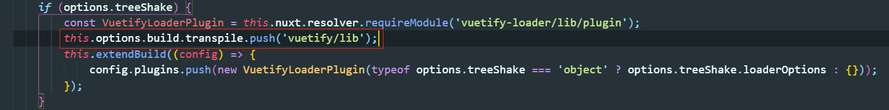

## Nuxt容器化过程中引发的疑问

### 为什么@nuxt/vuetify这个模块是配置在buildModules属性中

`buildModules`配置属性是Nuxt v2.9引入的，目的是减少一些开发以及构建阶段，使得生产环境启动更快速，并且能够减小生产环境中`node_modules`的大小。

`@nuxt/vuetify`这个包之所以不用在正式环境中安装，是因为该包源代码中指明了`vuetify/lib`中的文件需要经过webpack处理(node_modules/@nuxtjs/vuetify/build.js)：

经过webpack处理的文件会出现在打包之后的文件中，因此vuetify相关包不必再安装至node_modules。

### 为什么打包完成后，只将.nuxt文件夹引入容器中还不行，还需要node_moduels？

vue create出来的spa项目，通常打包之后只需要将dist文件夹放入到nginx的docker镜像中即可，但是ssr项目却还依赖于用户环境(node，依赖包node_modules)。如果跟随过[vue ssr文档](<https://ssr.vuejs.org/zh/#%E4%BB%80%E4%B9%88%E6%98%AF%E6%9C%8D%E5%8A%A1%E5%99%A8%E7%AB%AF%E6%B8%B2%E6%9F%93-ssr-%EF%BC%9F>)配置过ssr环境就很清楚，关于server端的打包过程中，会在webpack配置文件中指定`external`字段，该字段的值将会设置为排除第三方依赖包(可见[构建配置](<https://ssr.vuejs.org/zh/guide/build-config.html#%E6%9C%8D%E5%8A%A1%E5%99%A8%E9%85%8D%E7%BD%AE-server-config>)中webpack配置代码注释)。被排除的依赖包，将会在运行时的时候从node_moduels引入。所以如果只引入.nuxt文件夹，访问页面会出现包无法找到的错误。

### Nuxt项目容器化建议

容器化可以采用多阶段构建的方式，第一个阶段中执行build，第二个阶段中安装production环境依赖并启动项目。阶段一中产生出来的.nuxt文件夹和node_modules可以传递给阶段二，这里的node_modules可以执行`npm prune --production`保留必要的包。

