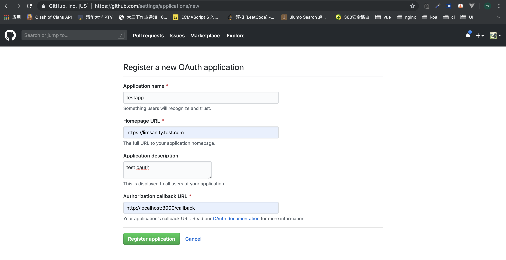

## OAuth登录流程

### 原理

- [GitHub OAuth 第三方登录示例教程](http://www.ruanyifeng.com/blog/2019/04/github-oauth.html)

### 实现

按照下图进入github创建一个Application：



创建成功后页面会有得到`client Id`和`client Secret`。

通过vue cli创建一个简单的vue应用进行代码实现，选项选择default即可：

```
vue create learn-oauth
```

安装要用到的库

```js
cnpm i axios -S
```

