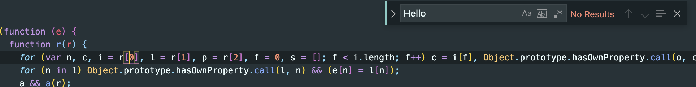
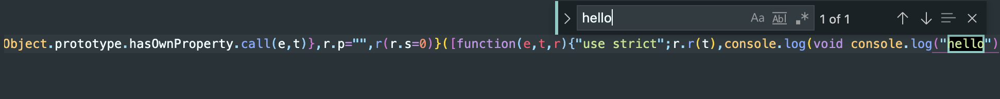
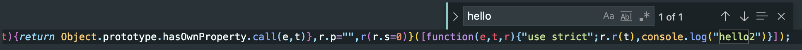
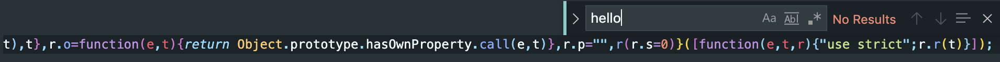

# Tree shaking

### 什么是Tree shaking

Tree shaking即Webpack会在打包过程去除一些没有用到的代码，依赖于import / export。

```js
// index.js
import { hello } from './utils'

// utils.js
export function hello () {
  console.log('hello')
}
```

添加了上述代码之后运行`npm run build`，在生成的dist目录中找到bundle.js文件，搜索`hello`。



```js
// index.js
import { hello } from './utils'

console.log(hello())
```

更改index.js，重复上述步骤：



得出结论，当import进来的函数未被使用时，会被treeshaking。


### Side Effects

并不是import进来的对象未被引用就会被完全tree shaking，也有可能该文件存在一些副作用代码，例如：

```js
// nomodules/a-my-utils/index.js
export function hello () {
  console.log('hello')
}

console.log('hello2')

// index.js
import { hello } from 'a-my-utils'
```

执行`npm run build`，输出的bundle.js中搜索hello2:



可以看到即便我们引用hello，但并没有使用它，`console.log('hello2')`依然未被tree shaking。这就是副作用代码，可以简单理解为导入后会被立刻调用的代码，例如IIFE。

希望把`console.log('hello2')`也tree shaking掉，则要在`package.json`中对`sideEffects`属性指定为`false`：

```js
// node_modules/my-utils/package.json
{
  "sideEffects": false
}
```

再次构建并搜索，此时就会被完全tree shaking。：



如果你的代码中确实存在副作用，你可以对`sideEffects`指定一个存储文件路径的数组，指定哪些文件存在副作用：

```js
{
  "sideEffects": ["./index.js"]
}
```


### 参考

[How to Fully Optimize Webpack 4 Tree Shaking](https://medium.com/@craigmiller160/how-to-fully-optimize-webpack-4-tree-shaking-405e1c76038)

[你的Tree-Shaking并没什么卵用](https://juejin.im/post/5a5652d8f265da3e497ff3de#heading-8)

[Webpack 中的 sideEffects 到底该怎么用？](https://juejin.im/post/5b4ff9ece51d45190c18bb65)

