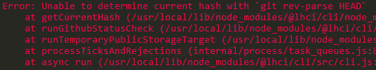

[TOC]

## lhci-ci集成初探

### 制作能够运行lhci-cli的docker镜像

运行lhci-cli所需要的环境：node、chromium、git。这里需要 git 是因为执行`lhci upload`时，会通过`git rev-parse HEAD`拿commit id，否则upload时则会出现以下报错：



#### 编写Dockerfile

```dockerfile
# Dockerfile
FROM node:12.8.1-alpine

RUN sed -i 's/dl-cdn.alpinelinux.org/mirrors.ustc.edu.cn/g' /etc/apk/repositories \
    && apk add --no-cache chromium git

RUN npm config set registry https://registry.npm.taobao.org \
    && npm i -g @lhci/cli@0.3.x
```

选用alpine版本的node镜像可以执行`apk`命令安装chromium和git，同时体积也比较小。

构建并发布镜像：

```bash
docker build -t limsanity3/node-lighthouse-ci:latest .
docker push limsanity3/node-lighthouse-ci
```

#### 测试镜像

使用vue cli创建一个简单项目

##### CI

在vue项目根目录添加`.gitlab-ci.yml`：

```dockerfile
stages:
  - build
  - audit
  
build:
  stage: build
  cache:
    key: "$CI_COMMIT_REF_NAME"
    paths:
    - node_modules/
  script:
    - npm i
    - npm run build
  artifacts:
    expire_in: 1 week
    paths:
      - dist

# 注意image中的镜像名填写自己发布的镜像
audit:
  stage: audit
  image: limsanity3/node-lighthouse-ci
  script:
    - lhci collect --staticDistDir=./dist --settings.chromeFlags='--no-sandbox --headless'
    - lhci upload --target=temporary-public-storage
```

这里没有直接运行`lhci autorun`是因为想指定chromeFlags。chromeFlags如果不指定`--no-sandbox`可能会出错，具体原因还没有详细了解。[chromeFlags的配置](<https://peter.sh/experiments/chromium-command-line-switches/>)。

这里的upload命令是上传至Google，命令行中会给出上传地址，例如：


### 关于Upload审计结果

lighthouse审计出来的结果可以选择传到自己的服务器。服务器的搭建可见[构建自己的Lighthouse CI Server](<https://limsanity.github.io/Web2/%E9%9B%86%E6%88%90lighthouse-ci.html#%E9%9B%86%E6%88%90lighthouse-ci>)，这篇是解决lighthouse-ci中readme而来的。

如果要上传到自己搭建的服务器中，需要解决一些问题：

- 如何结合CI在lighthouse server中创建项目
- 如何解决不重复创建的问题
- 如何获取当前项目的token进行上传

#### 问题一

通过`lhci wizard`可以创建项目，这个过程是交互式的，因此可以借鉴`lhci wizard`的实现。其实现主要就是调用lighthouse server的api接口进行创建，可以在postman中测试一下:

```bash
# POST
http://localhost:9001/v1/projects

# Body type:json
{
	"name": "test ci"
}
```

假设你根据上面步骤搭建了一个CI server，发送这个POST请求就可以创建一个项目，那么在CI流程中也可以通过curl等方法进行创建。

#### 问题二

当你再次执行上面的POST请求，同样可以创建一个同名的项目，因此如何创建不重复的项目就成为一个难题：通过项目id或token判断唯一的话，CI流程中如何获取这个id或token呢？

#### 问题三

审计结果上传到自己的服务器需要token，这个token在创建项目时可以获取到。问题二其实也跟这个问题有所管联，就是如何在CI中获取当前项目的token？