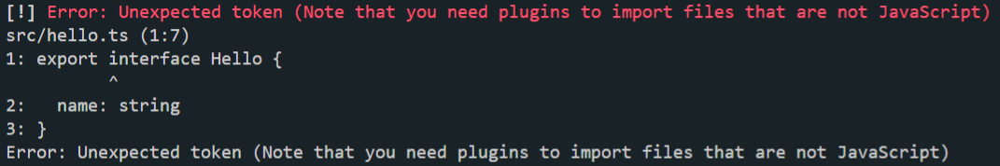
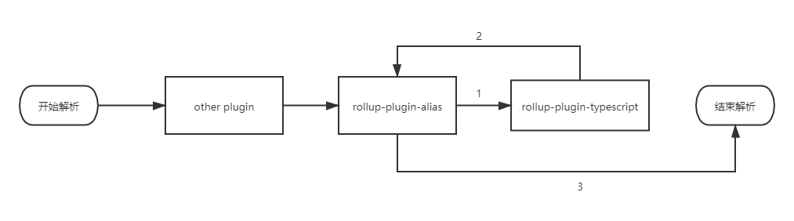
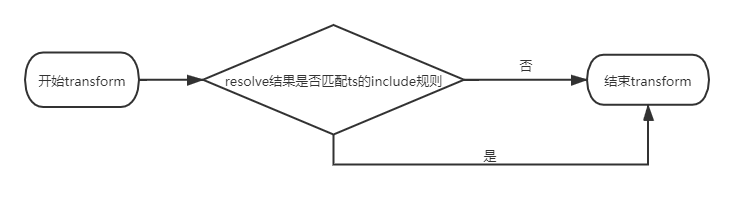

## rollup打包过程中alias与TS插件顺序引发的问题

### 写在前面

- [repro link](<https://github.com/Limsanity/rollup-alias-ts-repro>)

### 问题重现

```
// 当前项目下安装依赖
npm ci
// 运行打包命令
npm run build
```

会出现以下报错，意思就是没有引入ts插件导致其无法识别ts文件，但是`rollup-config-js`中已经引入了ts插件：



如果把`main.ts`中`import Hello from  '@/hello.ts'`改成`import Hello from  '@/hello'`就可以正常打包；又或者把alias插件顺序移到ts插件之后也可以。

### 问题解析

这个问题其实是typescript模块解析导致的，接下来具体分析以下整个流程。

```js
module.exports = function() {
  return {
    name: '...',
    resolveId(importee, importer): { ... },
    transform(code, id) { ... } // 该ts插件有该方法，alias则没有
  }
}
```

上面代码是一个resolve插件的基本架构，rollup在解析一个模块时就会逐个调用插件的`resolvedId`进行解析（如果插件有resolveId的话）。插件的调用顺序和配置文件中的编写顺序有关。我一开始对整个流程的理解是这样的：


但是实际上，是这样的：



最终的输出结果其实是由alias插件决定的。alias插件会根据配置规则转化路径，例如该repro中转换成`src/hello.ts`，然后传给ts插件后ts的模块解析就会出现问题。因为ts的模块解析器会根据根目录的中`tsconfig.json`的`baseUrl`配置进行匹配，匹配规则类似node，可见[ts模块解析](<https://www.tslang.cn/docs/handbook/module-resolution.html>)。匹配结果如下：

```js
failedLookupLocations:
[ 'C:/Users/xxx/Desktop/alias/src/hello.ts.ts',
     'C:/Users/xxx/Desktop/alias/src/hello.ts.tsx',
     'C:/Users/xxx/Desktop/alias/src/hello.ts.d.ts',
     'C:/Users/xxx/Desktop/alias/src/hello.ts/package.json',
     'C:/Users/xxx/Desktop/alias/src/hello.ts/index.ts',
     'C:/Users/xxx/Desktop/alias/src/hello.ts/index.tsx',
     'C:/Users/xxx/Desktop/alias/src/hello.ts/index.d.ts',     'C:/Users/xxx/Desktop/alias/src/node_modules/src/hello.ts/package.json',
 ......
]
```

很容易可以看出ts模块解析在路径后面又拼接了`.ts`后缀，这样就导致文件查找失败，此时ts插件resolve的结果为null。alias插件则会判断回传的结果，如果结果为null，则把原来传入ts插件的`src/hello.ts`作为输出结果。

拿到了输出结果之后就会执行transform步骤：



transform步骤中ts插件会首先判断是否符合默认的includes规则（`C:/Users/xxx/Desktop/rollup-alias-ts-repro/*.ts+(|x)`或`C:/Users/xxx/Desktop/rollup-alias-ts-repro/**/*.ts+(|x)`），因为resolve步骤中拿到的是`src/hello.ts`，不符合includes规则，typescript就不会对代码进行transform，最终出现上述报错。

如果把`import Hello from '@/home.ts'`改成`import Hello from '@/home`，resolve步骤中ts模块解析就会解析成功，ts解析器将`src/home`变为`src/home.ts`，从而得到匹配文件路径，这时候传递给alias的结果则是`C:/Users/xxx/Desktop/rollup-alias-ts-repro/src/hello.ts`。随后的transform步骤中，该绝对路径符合includes规则，ts会对代码进行transform。

如果alias插件移到ts插件之后，对路径映射`@`处理则由ts插件中调用ts解析器进行完成，其规则根据`tsconfig.sjon`中path配置决定，该repro中则是将`@/*`转换成`src/*`，因此也能正确解析`@/hello.ts`，依然不会出现报错。

### 总结

总的来说就是alias插件处理完路径映射之后导致ts解析器解析文件失败，对整个流程进行分析有助于熟悉了解rollup工作流程。