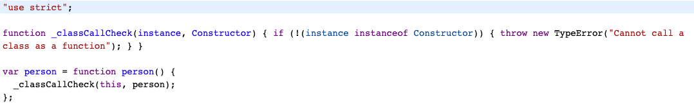
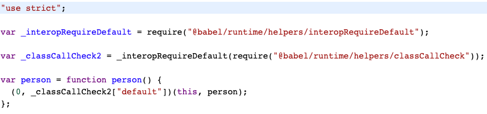

## 理解Babel 

### transform-runtime

使用transform-runtime的原因

- babel转译的过程会使用一些公共函数，例如`_classCallCheck`，默认情况下这些函数都会加入到每个文件中，这就会造成重复，而`@babel/plugin-transform-runtime`可以将这些函数抽取到一起，然后指向`@babel/runtime`。
- 使用`@babel/polyfill`转译代码会造成全局污染，这种方式适合开发业务而不适合开发第三方库。transform-runtime则不会造成全局污染。

引入`@babel/plugin-transform-runtime`前：

引入后：

