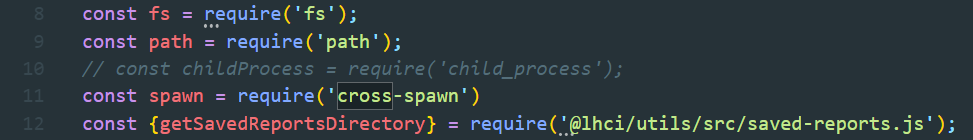
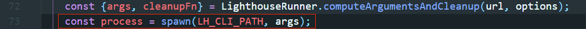

## 集成lighthouse-ci

### 安装运行lighthouse-ci

[lighthouse-ci仓库](<https://github.com/GoogleChrome/lighthouse-ci>)

本地使用vue cli新建一个测试项目

安装lighthouse的cli工具：

```bash
npm i -g @lhci/cli@0.3.x
```

进入测试项目打包项目：

```bash
npm run build
```

执行lhci：

```bash
lhci autorun
```

windows环境下，会出现 `child_process spawn UNKNOWN` 的问题，可见 [issue](<https://github.com/GoogleChrome/lighthouse-ci/issues/67>)。根据terminal报错提示找到`lighthouse-runner.js`文件，按照issue提出者简单的添加`{ shell: true}`会出现无效字符的报错（和`#!/usr/env`有关，具体区别后续再研究）。

为了能正常在windows下运行lhci，目前使用了比较hack的方法：

根据terminal报错进入`C:\Users\yourUserName\AppData\Roaming\npm\node_modules\@lhci\cli`（注意yourUserName是你在windows主机上的用户名）。

安装`cross-spawn`：

```bash
npm i cross-spawn
```

将`lighthouse-runner.js`中child_process改成cross-spawn：





此时再次运行`lhci autorun`即可。

### 构建自己的Lighthouse CI Server

[基于Docker搭建LHCI Server](<https://github.com/GoogleChrome/lighthouse-ci/tree/master/docs/recipes/docker-server>)

[Lighthouse CI Server搭建完成后的操作](<https://github.com/GoogleChrome/lighthouse-ci/blob/master/docs/getting-started.md#the-lighthouse-ci-server>)

创建docker volume：

```bash
docker volume create lhci-data
```

拉取镜像：

```bash
docker pull patrickhulce/lhci-server
```

运行docker container：

```bash
docker container run --publish 9001:9001 --mount source=lhci-data,target=/data --detach patrickhulce/lhci-server
```

启动完成后访问`localhost:9001/app`，页面会提示你执行`lhci wizard`新建项目。

执行`lhci wizard`，按照提示填写，LHCI Server的url为`http://localhost:9001`，随机生成token。

最后执行:

```bash
lhci upload --serverBaseUrl=http://localhost:9001 --toekn=${tokenGeneratedAbove}
```

再次访问`localhost:9001/app`，就可以看到项目的评分数据。